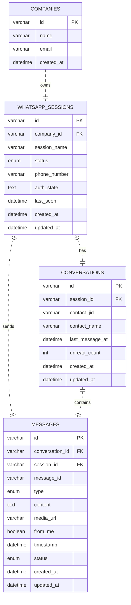

# SDD Technical Design: WhatsApp Integration (Phase 2)

## 1. Module Structure for `apps/api/src/modules/whatsapp/`

```
src/
└── modules/
    └── whatsapp/
        ├── controllers/
        │   ├── session.controller.ts          # CRUD operations for WhatsApp sessions
        │   ├── session-status.controller.ts   # QR code generation and status endpoints
        │   ├── message.controller.ts          # Send messages and conversation management
        │   ├── conversation.controller.ts     # List conversations for a session
        │   └── webhook.controller.ts          # Baileys webhook for incoming events
        ├── services/
        │   ├── baileys-client.service.ts      # Core Baileys client wrapper
        │   ├── baileys-auth.service.ts        # Auth state management (encryption/decryption)
        │   ├── baileys-reconnect.service.ts   # Auto-reconnect logic with exponential backoff
        │   ├── qr.service.ts                  # QR code generation
        │   ├── qr-events.service.ts           # QR event emitter for WebSocket
        │   ├── message-handler.service.ts     # Process inbound messages from Baileys
        │   ├── message-relay.service.ts       # Relay messages to WebSocket and database
        │   ├── session-manager.service.ts     # CRUD operations + health monitoring
        │   └── anti-ban/
        │       ├── rate-limiter.ts            # Rate limiting per session
        │       ├── humanizer.ts               # Human-like delays between actions
        │       ├── fingerprint.ts             # User-Agent rotation
        │       └── health-monitor.ts          # Session health monitoring
        ├── gateways/
        │   ├── whatsapp.gateway.ts            # Socket.io gateway for real-time events
        │   └── events.ts                      # Event names and types definition
        ├── dto/
        │   ├── create-session.dto.ts          # DTO for creating a new session
        │   └── send-message.dto.ts            # DTO for sending messages
        ├── repositories/
        │   ├── session.repository.ts          # Repository for whatsapp_sessions table
        │   ├── message.repository.ts          # Repository for messages table
        │   └── conversation.repository.ts     # Repository for conversations table
        ├── entities/
        │   ├── session.entity.ts              # TypeORM entity for whatsapp_sessions
        │   ├── message.entity.ts              # TypeORM entity for messages
        │   └── conversation.entity.ts         # TypeORM entity for conversations
        ├── index.ts                           # Barrel exports
        └── whatsapp.module.ts                 # NestJS module definition
```

## 2. Data Model

### Entities and Relationships

#### whatsapp_sessions Table
```sql
CREATE TABLE whatsapp_sessions (
    id VARCHAR(36) PRIMARY KEY, -- UUID
    company_id VARCHAR(36) NOT NULL, -- FK to companies table
    session_name VARCHAR(100) NOT NULL,
    status ENUM('DISCONNECTED', 'CONNECTING', 'QR_CODE', 'CONNECTED', 'ERROR') DEFAULT 'DISCONNECTED',
    phone_number VARCHAR(20),
    auth_state TEXT, -- Encrypted Baileys auth state
    last_seen DATETIME,
    created_at DATETIME DEFAULT CURRENT_TIMESTAMP,
    updated_at DATETIME DEFAULT CURRENT_TIMESTAMP ON UPDATE CURRENT_TIMESTAMP,
    FOREIGN KEY (company_id) REFERENCES companies(id) ON DELETE CASCADE
);
```

#### conversations Table
```sql
CREATE TABLE conversations (
    id VARCHAR(36) PRIMARY KEY, -- UUID
    session_id VARCHAR(36) NOT NULL, -- FK to whatsapp_sessions
    contact_jid VARCHAR(100) NOT NULL, -- WhatsApp JID of contact
    contact_name VARCHAR(255),
    last_message_at DATETIME,
    unread_count INT DEFAULT 0,
    created_at DATETIME DEFAULT CURRENT_TIMESTAMP,
    updated_at DATETIME DEFAULT CURRENT_TIMESTAMP ON UPDATE CURRENT_TIMESTAMP,
    FOREIGN KEY (session_id) REFERENCES whatsapp_sessions(id) ON DELETE CASCADE,
    UNIQUE KEY unique_session_contact (session_id, contact_jid)
);
```

#### messages Table
```sql
CREATE TABLE messages (
    id VARCHAR(36) PRIMARY KEY, -- UUID
    conversation_id VARCHAR(36) NOT NULL, -- FK to conversations
    session_id VARCHAR(36) NOT NULL, -- FK to whatsapp_sessions (denormalized for queries)
    message_id VARCHAR(100) NOT NULL, -- Baileys message ID
    type ENUM('text', 'image', 'video', 'document', 'audio', 'location', 'contact', 'sticker') NOT NULL,
    content TEXT, -- Message content or media caption
    media_url VARCHAR(500), -- URL to media if applicable
    from_me BOOLEAN NOT NULL, -- True if sent by us, false if received
    timestamp DATETIME NOT NULL, -- When message was sent/received
    status ENUM('PENDING', 'SENT', 'DELIVERED', 'READ', 'FAILED') DEFAULT 'PENDING',
    created_at DATETIME DEFAULT CURRENT_TIMESTAMP,
    updated_at DATETIME DEFAULT CURRENT_TIMESTAMP ON UPDATE CURRENT_TIMESTAMP,
    FOREIGN KEY (conversation_id) REFERENCES conversations(id) ON DELETE CASCADE,
    FOREIGN KEY (session_id) REFERENCES whatsapp_sessions(id) ON DELETE CASCADE,
    UNIQUE KEY unique_session_message (session_id, message_id)
);
```

### Entity Relationships
- One company can have multiple WhatsApp sessions (one-to-many)
- One session can have multiple conversations (one-to-many)
- One conversation belongs to one session (many-to-one)
- One conversation can have multiple messages (one-to-many)
- One message belongs to one conversation (many-to-one)
- One message belongs to one session (many-to-one, denormalized for performance)

## 3. Baileys Client Architecture

### Core Components
1. **Baileys Client Wrapper** (`baileys-client.service.ts`)
   - Singleton instance per company session
   - Handles Baileys initialization with QR code generation
   - Manages event listeners for connection state, messages, etc.
   - Provides methods for sending messages, getting contacts, etc.

2. **Auth State Management** (`baileys-auth.service.ts`)
   - Encrypts/decrypts Baileys auth state using company-specific key
   - Persists auth state to database for session persistence
   - Handles migration of auth state between instances

3. **Reconnection Service** (`baileys-reconnect.service.ts`)
   - Implements exponential backoff reconnection strategy
   - Monitors connection health via periodic pings
   - Triggers reconnection on specific error codes
   - Maintains reconnection attempt counters

### Lifecycle Management
- **Initialization**: Load auth state from DB → Create Baileys instance → Set up event listeners
- **Connection**: Baileys emits `connection.update` → Update session status
- **QR Code**: When state is `QR_CODE`, generate QR and emit via WebSocket
- **Messages**: On `messages.upsert`, process through message handler
- **Disconnection**: On connection loss, trigger reconnection service
- **Shutdown**: Save auth state to DB before destroying Baileys instance

## 4. WebSocket Event Flow

### Event Flow Diagram
```
[User Phone] 
    ↓ (WhatsApp Message)
[Baileys Client] 
    ↓ (messages.upsert event)
[Message Handler Service] 
    ↓ (Process & Save to DB)
[Message Relay Service] 
    ↓ (Save to DB + Emit via WS)
[WhatsApp Gateway] 
    ↓ (Socket.io Event: message:received)
[Frontend] 
    ↓ (Update Chat UI in Real-time)
```

### WebSocket Events
#### From Backend to Frontend
- `qr:generated` - When QR code is ready for scanning
- `session:statusChanged` - When session status changes (connecting, connected, etc.)
- `message:received` - When new message is received from WhatsApp
- `message:sent` - When message is successfully sent
- `conversation:updated` - When conversation list needs refresh
- `session:health` - Periodic health updates

#### From Frontend to Backend
- `session:connect` - Request to initiate QR code generation
- `session:disconnect` - Request to logout/disconnect session
- `message:send` - Request to send a message
- `session:fetch` = Request to fetch session status

### Socket.io Gateway Implementation
- Namespace: `/whatsapp`
- Rooms: Per session (e.g., `session-{sessionId}`)
- Authentication: JWT token verification
- Error handling: Automatic reconnection with exponential backoff

## 5. API Endpoints

### REST Endpoints
#### Session Management
- `POST /api/whatsapp/sessions` - Create new WhatsApp session
- `GET /api/whatsapp/sessions` - List all sessions for company
- `GET /api/whatsapp/sessions/:id` - Get specific session details
- `DELETE /api/whatsapp/sessions/:id` - Delete/logout session
- `POST /api/whatsapp/sessions/:id/reconnect` - Force reconnection

#### QR Code & Status
- `GET /api/whatsapp/sessions/:id/qr` - Generate QR code for session
- `GET /api/whatsapp/sessions/:id/status` - Get current session status

#### Message Management
- `POST /api/whatsapp/sessions/:id/messages` - Send message via WhatsApp
- `GET /api/whatsapp/sessions/:id/conversations` - List conversations
- `GET /api/whatsapp/sessions/:id/conversations/:conversationId/messages` - Get messages for conversation

#### Webhook (for alternative integration)
- `POST /api/whatsapp/webhook` - Receive events from Baileys (backup to WS)

### WebSocket Endpoints
- `GET /api/whatsapp` - Socket.io connection endpoint (namespace: `/whatsapp`)

## 6. Frontend Component Tree

```
apps/web/src/
├── app/
│   └── (dashboard)/
│       ├── whatsapp/
│       │   ├── page.tsx              # WhatsApp settings page (session list)
│       │   └── connect/
│       │       └── page.tsx          # QR scan page
│       └── chats/
│           ├── page.tsx              # Main chats page
│           └── layout.tsx            # Chat layout (sidebar + view)
├── components/
│   ├── whatsapp/
│   │   ├── qr-scanner.tsx            # QR display + status
│   │   ├── session-card.tsx          # Individual session card
│   │   ├── connection-status.tsx     # Connection status badge
│   │   └── session-list.tsx          # Grid of session cards
│   └── chats/
│       ├── chat-sidebar.tsx          # Conversation list
│       ├── chat-list-item.tsx        # Single conversation item
│       ├── chat-messages.tsx         # Message scroll container
│       ├── message-bubble.tsx        # In/out message bubble
│       ├── chat-header.tsx           # Contact info header
│       ├── media-preview.tsx         # Image/document preview
│       ├── chat-input.tsx            # Input + send button
│       ├── chat-actions.tsx          # Attach/emoji/etc
│       └── empty-state.tsx           # No conversations state
├── hooks/
│   ├── use-whatsapp-socket.ts        # WebSocket connection hook
│   ├── use-chats.ts                  # Chats list + messages hook
│   ├── use-send-message.ts           # Send message hook
│   └── use-session-manager.ts        # Session management hook
└── stores/
    ├── chat-store.ts                 # Zustand store for chat state
    └:// session-store.ts              # Zustand store for session state
```

### State Management
- **Zustand Stores**: Used for global state sharing between components
- **Session Store**: Tracks all WhatsApp sessions for the company
- **Chat Store**: Tracks active conversation, messages, and UI state
- **React Query**: Used for server state caching and mutations

### Key Frontend Features
- Real-time QR code display with WebSocket updates
- Conversation list with unread badges
- Infinite scrolling message view
- Message bubbles with avatar and timestamps
- Media preview for images/documents
- Input with emoji picker and attachment support
- Connection status indicators (connecting, connected, disconnected)
- Auto-scroll to bottom when new messages arrive

## 7. Anti-ban Strategy

### Rate Limiting
- **Per-Session Limits**: Configurable limits per hour/day
- **Message Rate Limiting**: Max X messages per minute
- **Action Rate Limiting**: Max Y actions (typing, status updates) per minute
- **Exponential Backoff**: Increase delays after rate limit hits
- **Queue System**: Buffer actions when limits are reached

### Humanizer Delays
- **Typing Simulation**: Random delays between 1-3 seconds before sending
- **Action Variability**: Randomize intervals between actions
- **Break Simulation**: Periodic longer pauses (5-30 seconds) to mimic human behavior
- **Working Hours**: Respect configured quiet hours (no activity during sleep times)

### Health Monitoring
- **Connection Health**: Ping/pong mechanism every 30 seconds
- **Error Tracking**: Track and categorize different error types
- **Session Recovery**: Automatic recovery from common error states
- **Metrics Collection**: Track message success rates, latency, etc.
- **Alerting**: Notify administrators of unhealthy sessions

### Fingerprinting Evasion
- **User-Agent Rotation**: Rotate between common mobile User-Agents
- **Header Variation**: Slight variations in HTTP headers
- **Request Timing**: Vary timing of requests to avoid patterns
- **Version Rotation**: Periodically update Baileys version

## 8. Error Handling and Reconnection Strategy

### Error Classification
1. **Recoverable Errors**: Network issues, timeouts, temporary bans
2. **Session Errors**: Invalid credentials, logged out elsewhere
3. **Fatal Errors**: Permanent bans, device blocking
4. **Baileys Errors**: Library-specific errors requiring restart

### Reconnection Strategy
#### Exponential Backoff
```
Attempt 1: 1 second delay
Attempt 2: 2 seconds delay
Attempt 3: 4 seconds delay
Attempt 4: 8 seconds delay
...
Max delay: 5 minutes
```

#### Specific Error Handling
- **Authentication Errors**: Force QR regeneration
- **Network Errors**: Simple retry with backoff
- **Rate Limit Errors**: Respect retry-after headers, extend delays
- **Blocked Errors**: Enter cooldown period before retry
- **Logged Out Errors**: Require manual QR rescan

### Circuit Breaker Pattern
- Failure threshold: 5 consecutive failures
- Timeout: 5 minutes before attempting recovery
- Half-open state: Test with single request before full recovery

### Error Reporting
- Log errors with context to monitoring system
- Provide user-friendly error messages in UI
- Track error rates per session for admin dashboard
- Send alerts for repeated failures

## 9. Tables and Their Relationships

### Database Schema Overview


### Indexes for Performance
```sql
-- WhatsApp Sessions
CREATE INDEX idx_whatsapp_sessions_company ON whatsapp_sessions(company_id);
CREATE INDEX idx_whatsapp_sessions_status ON whatsapp_sessions(status);
CREATE INDEX idx_whatsapp_sessions_last_seen ON whatsapp_sessions(last_seen);

-- Conversations
CREATE INDEX idx_conversations_session ON conversations(session_id);
CREATE INDEX idx_conversations_last_message ON conversations(last_message_at);
CREATE INDEX idx_conversations_unread ON conversations(unread_count) WHERE unread_count > 0;

-- Messages
CREATE INDEX idx_messages_conversation ON messages(conversation_id);
CREATE INDEX idx_messages_session ON messages(session_id);
CREATE INDEX idx_messages_timestamp ON messages(timestamp);
CREATE INDEX idx_messages_from_me ON messages(from_me);
CREATE INDEX idx_messages_status ON messages(status);
CREATE INDEX idx_messages_session_timestamp ON messages(session_id, timestamp DESC);
```

### Relationship Constraints
- **Cascade Delete**: When a company is deleted, all its WhatsApp sessions are deleted
- **Cascade Delete**: When a session is deleted, all its conversations and messages are deleted
- **Cascade Delete**: When a conversation is deleted, all its messages are deleted
- **Unique Constraints**: Prevent duplicate sessions per company, duplicate conversations per session-contact

## Implementation Notes

### Technology Stack
- **Backend**: NestJS, TypeORM, MySQL, Socket.io
- **WhatsApp**: Baileys library (version pinned in package.json)
- **Frontend**: Next.js, React, Zustand, Socket.io client
- **State Management**: Zustand for client-side, React Query for server state
- **Styling**: Tailwind CSS with shadcn/ui components

### Security Considerations
- Auth state encryption using company-specific keys
- JWT authentication for all API and WebSocket endpoints
- Input validation and sanitization on all endpoints
- Rate limiting on API endpoints to prevent abuse
- CORS policies restricted to trusted domains

### Deployment Considerations
- Session affinity required for WebSocket connections (or use Redis adapter)
- Database connection pooling for handling multiple concurrent sessions
- Memory management for Baileys instances (monitor for leaks)
- Log rotation for session-specific logs
- Backup strategy for auth state data

## Risks and Mitigations

### Technical Risks
1. **Baileys API Changes**: Mitigated by pinning version and monitoring upstream
2. **Memory Leaks**: Mitigated by proper instance cleanup and monitoring
3. **Database Performance**: Mitigated by proper indexing and query optimization
4. **WebSocket Scaling**: Mitigated by using Redis adapter for multi-instance deployments

### Operational Risks
1. **WhatsApp Bans**: Mitigated by anti-ban layer and rate limiting
2. **Session Loss**: Mitigated by persistent auth state storage
3. **Message Loss**: Mitigated by database persistence and acknowledgments

## Success Criteria
1. User scans QR → session connects in < 30s
2. Message sent from phone → appears in chat UI in < 5s
3. User sends reply from UI → contact receives it
4. Session auto-reconnects on network drop
5. Build passes with zero errors
6. Anti-ban mechanisms prevent premature bans in testing